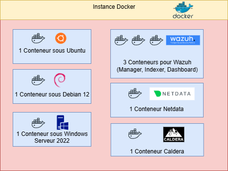

# Purple Team Lab — Proof of Concept

  
*Schéma d’architecture du lab* (à remplacer par ton diagramme)

---

## 📝 Description

Ce lab “all-in-one” a été conçu pour démontrer l’intérêt d’un **XDR/EDR** et permettre à une équipe Purple Team de simuler des attaques sur des serveurs isolés, tout en collectant les données de sécurité et d’observabilité.  

Le lab est entièrement **conteneurisé via Docker**, ce qui permet :  
- un déploiement rapide et reproductible,  
- des tests sur différentes cibles (Linux, Windows) sans impacter d’autres environnements,  
- la visualisation des alertes et métriques via Wazuh et Netdata,  
- l’exécution de scénarios d’attaques automatisés via Caldera.  

---

## ⚙️ Conteneurs inclus

| Conteneur | Description |
|-----------|------------|
| `debian12` | Serveur Debian 12 isolé pour tests de configuration et vulnérabilités classiques |
| `ubuntu` | Serveur Ubuntu pour diversité des cibles |
| `windows` | Windows Server 2022 pour tests d’attaques sur OS Windows et collecte des Event Logs |
| `wazuh.manager` / `wazuh.indexer` / `wazuh.dashboard` | Stack EDR/XDR pour collecte, corrélation et visualisation des logs |
| `netdata` | Observabilité système temps réel (CPU, I/O, réseau, etc.) |
| `caldera` | Framework Purple Team pour orchestrer des attaques automatisées |

---

## 🚀 Déploiement

### Pré-requis
- Debian 12 pour le serveur de lab  
- Accès root ou sudo  
- Connexion Internet  

### Installation et déploiement automatisés
Le script `deploy_lab.sh` installe Docker, clone les dépôts nécessaires et déploie tous les conteneurs du lab :

```bash
sudo bash deploy_lab.sh
